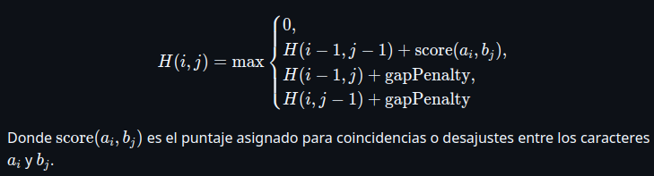
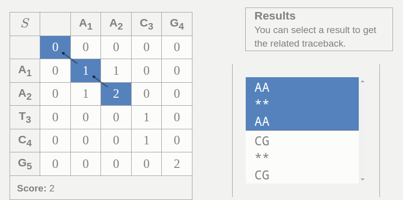
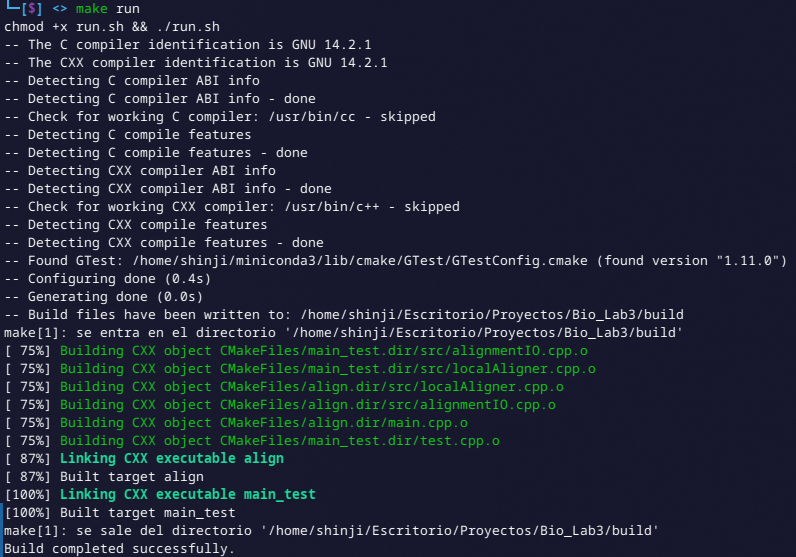
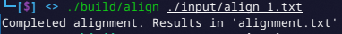
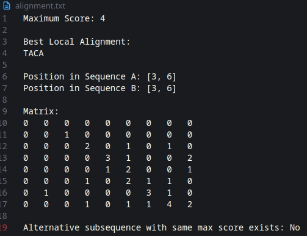
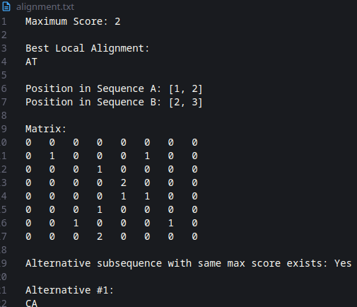
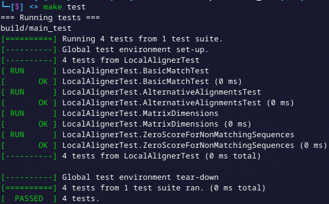

# Alineamiento Local

De Braulio Nayap Maldonado Casilla

## Introducción

El **alineamiento local**, también conocido como alineamiento de Smith-Waterman, es una técnica utilizada para encontrar la mejor región local de similitud entre dos secuencias biológicas, como cadenas de ADN, ARN o proteínas. A diferencia del alineamiento global, que compara secuencia completa contra secuencia completa, el alineamiento local identifica subsecuencias parciales que se alinean con mayor similitud, ignorando las regiones no relacionadas o divergentes.

Matemáticamente, el algoritmo se basa en programación dinámica y calcula una matriz de puntajes donde cada celda $(i, j)$ representa el mejor puntaje de alineamiento local entre los prefijos de las secuencias hasta las posiciones $i$ y $j$. Se consideran tres posibles caminos para calcular cada celda: coincidencia/mismatch (diagonal), inserción (arriba) y deleción (izquierda), pero con la condición de que los puntajes negativos se reemplazan por cero para asegurar que sólo se acumulen alineamientos con puntuaciones positivas:



La matriz se completa evaluando todos los pares de posiciones, y el valor máximo encontrado indica el final del mejor alineamiento local. A partir de esta posición, se realiza un retroceso (backtracking) hasta encontrar una celda con valor cero, reconstruyendo así las subsecuencias alineadas.



## Implementación

### 1. Estructura Resultado Local

Primero, la estructura `LocalAlignmentResult` está diseñada para almacenar toda la información relevante que resulta del proceso de alineamiento local entre dos secuencias. Dentro de ella, el campo `maxScore` guarda la puntuación máxima obtenida en la matriz de puntajes, que representa la mejor coincidencia encontrada. La matriz `scoreMatrix` es una matriz bidimensional que almacena los valores de puntuación calculados para cada par de posiciones entre las secuencias comparadas, reflejando el progreso del algoritmo. `bestAlignment` es una cadena de texto que contiene la mejor alineación resultante, expresada en formato legible. Los campos `startPosA` y `startPosB` son pares de enteros que indican las posiciones iniciales en cada una de las secuencias desde donde comienza el mejor alineamiento encontrado, permitiendo ubicarlo exactamente. El booleano `hasAlternative` señala si existen alineamientos alternativos de igual puntuación que la mejor. Finalmente, el vector `alternativeAlignments` guarda esos alineamientos alternativos, si los hay, para un análisis más completo.

```cpp
struct LocalAlignmentResult
{
    int maxScore;
    std::vector<std::vector<int>> scoreMatrix;
    std::string bestAlignment;
    std::pair<int, int> startPosA;
    std::pair<int, int> startPosB;
    bool hasAlternative;
    std::vector<std::string> alternativeAlignments;
};
```

### 2. Alineamiento Local

La clase `LocalAligner` es la clase princiapl que se encargara de generar el alineamiento local. Se alamacenaran como valores el score maximo actual, las penalidades de diferencia y gap.

```cpp
class LocalAligner
{
private:
    int matchScore, mismatchPenalty, gapPenalty;
    std::pair<int, int> fillScoreMatrix(const std::string &a, const std::string &b,
                                std::vector<std::vector<int>> &dp, int &maxScore);
    std::pair<std::string, std::string> backtrackAlignment(const std::string &a, const std::string &b,
                                const std::vector<std::vector<int>> &dp,
                                std::pair<int, int> maxPos);
    bool checkAlternativeMax(const std::vector<std::vector<int>> &dp, std::pair<int, int> maxPos, int maxScore);
    std::vector<std::pair<int, int>> findAlternativeMaxPositions(
                    const std::vector<std::vector<int>> &dp,
                    std::pair<int, int> maxPos, int maxScore);

public:
    LocalAligner(int match = 2, int mismatch = -1, int gap = -2)
        : matchScore(match), mismatchPenalty(mismatch), gapPenalty(gap) {}
    LocalAlignmentResult align(const std::string &a, const std::string &b);
};
```

La función `fillScoreMatrix` llena la matriz `dp` según el algoritmo de Smith-Waterman. Compara caracteres de `a` y `b` para calcular coincidencias, desajustes y penalizaciones por gap. Asigna a cada celda el máximo entre 0 y los valores derivados de las celdas vecinas. A medida que llena la matriz, guarda el mayor puntaje y su posición, la cual devuelve para reconstruir el alineamiento óptimo.

```cpp
std::pair<int, int> LocalAligner::fillScoreMatrix(const std::string &a, const std::string &b,
                                    std::vector<std::vector<int>> &dp, int &maxScore)
{
    int m = a.size();
    int n = b.size();
    std::pair<int, int> maxPos{0, 0};
    maxScore = 0;
    for (int i = 1; i <= m; ++i)
        for (int j = 1; j <= n; ++j)
        {
            int match = (a[i - 1] == b[j - 1]) ? matchScore : mismatchPenalty;
            int diag = dp[i - 1][j - 1] + match;
            int up = dp[i - 1][j] + gapPenalty;
            int left = dp[i][j - 1] + gapPenalty;
            dp[i][j] = std::max(0, std::max({diag, up, left}));
            if (dp[i][j] > maxScore)
            {
                maxScore = dp[i][j];
                maxPos = {i, j};
            }
        }
    return maxPos;
}
```

La función `backtrackAlignment` reconstruye el mejor alineamiento local desde la posición de mayor puntaje. Retrocede en la matriz mientras los valores sean mayores a cero, comparando las celdas vecinas para determinar si hubo coincidencia o se insertó un gap. Devuelve dos cadenas representando el alineamiento óptimo.

```cpp
std::pair<std::string, std::string> LocalAligner::backtrackAlignment(const std::string &a, const std::string &b,
                                    const std::vector<std::vector<int>> &dp,
                                    std::pair<int, int> maxPos)
{
    std::string alignedA, alignedB;
    int i = maxPos.first;
    int j = maxPos.second;

    while (i > 0 && j > 0 && dp[i][j] != 0)
    {
        int score = dp[i][j];
        int scoreDiag = dp[i - 1][j - 1];
        int scoreUp = dp[i - 1][j];
        int scoreLeft = dp[i][j - 1];
        int match = (a[i - 1] == b[j - 1]) ? matchScore : mismatchPenalty;
        if (score == scoreDiag + match)
        {
            alignedA = a[i - 1] + alignedA;
            alignedB = b[j - 1] + alignedB;
            --i;
            --j;
        }
        else if (score == scoreUp + gapPenalty)
        {
            alignedA = a[i - 1] + alignedA;
            alignedB = '-' + alignedB;
            --i;
        }
        else
        {
            alignedA = '-' + alignedA;
            alignedB = b[j - 1] + alignedB;
            --j;
        }
    }
    return {alignedA, alignedB};
}
```

La función `checkAlternativeMax` busca en la matriz si existen otras posiciones, distintas de `maxPos`, con el mismo puntaje máximo. Si encuentra al menos una, devuelve `true`, indicando que hay alineamientos alternativos con el mismo score.

```cpp
bool LocalAligner::checkAlternativeMax(const std::vector<std::vector<int>> &dp,
                                std::pair<int, int> maxPos, int maxScore)
{
    int m = dp.size();
    int n = dp[0].size();
    for (int i = 0; i < m; ++i)
        for (int j = 0; j < n; ++j)
            if ((i != maxPos.first || j != maxPos.second) && dp[i][j] == maxScore)
                return true;
    return false;
}
```

La función `findAlternativeMaxPositions` identifica todas las posiciones distintas a `maxPos` que también tienen el puntaje máximo en la matriz. Retorna un vector con estas posiciones para generar alineamientos alternativos.

```cpp
std::vector<std::pair<int, int>> LocalAligner::findAlternativeMaxPositions(
    const std::vector<std::vector<int>> &dp,
    std::pair<int, int> maxPos, int maxScore)
{
    int m = dp.size();
    int n = dp[0].size();
    std::vector<std::pair<int, int>> altPositions;
    for (int i = 0; i < m; ++i)
        for (int j = 0; j < n; ++j)
            if ((i != maxPos.first || j != maxPos.second) && dp[i][j] == maxScore)
                altPositions.push_back({i, j});
    return altPositions;
}
```

La función `align` coordina todo el proceso de alineamiento local. Inicializa la matriz, calcula puntajes con `fillScoreMatrix`, reconstruye la mejor alineación con `backtrackAlignment`, y detecta otras posibles alineaciones. Retorna un `LocalAlignmentResult` con toda la información obtenida.

```cpp
LocalAlignmentResult LocalAligner::align(const std::string &a, const std::string &b)
{
    int m = a.size();
    int n = b.size();
    std::vector<std::vector<int>> dp(m + 1, std::vector<int>(n + 1, 0));
    int maxScore;
    std::pair<int, int> maxPos = fillScoreMatrix(a, b, dp, maxScore);
    auto bestAlignment = backtrackAlignment(a, b, dp, maxPos);
    int startI = maxPos.first - bestAlignment.first.size();
    int startJ = maxPos.second - bestAlignment.second.size();
    std::pair<int, int> startPosA = {startI, maxPos.first - 1};
    std::pair<int, int> startPosB = {startJ, maxPos.second - 1};
    std::string bestA = bestAlignment.first;
    std::vector<std::string> altAlignments;
    bool hasAlternative = false;
    if (maxScore > 0)
    {
        std::vector<std::pair<int, int>> altPositions = findAlternativeMaxPositions(dp, maxPos, maxScore);
        for (auto &pos : altPositions)
        {
            auto alignment = backtrackAlignment(a, b, dp, pos);
            altAlignments.push_back(alignment.first);
        }
        bool hasAlternative = !altAlignments.empty();
    }
    return LocalAlignmentResult{
        maxScore,
        dp,
        bestA,
        startPosA,
        startPosB,
        hasAlternative,
        altAlignments};
}
```

### 3. Lectura y Escritura de Datos

La clase `AlignmentIO` es la encargada de leer archivos que contengan dos cadenas y de almacenar los datos del alineamiento en un txt.

```cpp
class AlignmentIO
{
public:
    static std::pair<std::string, std::string> loadSequences(const std::string &filename);
    static void writeToFile(const std::string &filename,
                            const LocalAlignmentResult &result);
};
```

La función `loadSequences` abre un archivo de texto, lee dos líneas que contienen las secuencias y las devuelve como un par. Si el archivo no se puede abrir o leer, lanza una excepción. Si todo va bien, retorna las dos cadenas correspondientes a cada línea.

```cpp
std::pair<std::string, std::string> AlignmentIO::loadSequences(const std::string &filename)
{
    std::ifstream file(filename);
    if (!file)
        throw std::runtime_error("Could not open file: " + filename);
    std::string line1, line2;
    if (!std::getline(file, line1) || !std::getline(file, line2))
        throw std::runtime_error("Error reading lines from file: " + filename);
    return {line1, line2};
}
```

La función `writeToFile` guarda en un archivo el resultado del alineamiento local: puntaje máximo, mejor alineación, posiciones iniciales y matriz de puntuación. También anota si hay alineamientos alternativos, y en tal caso, los escribe uno por uno. Si el archivo no puede abrirse, muestra un error.

```cpp
void AlignmentIO::writeToFile(const std::string &filename,
                              const LocalAlignmentResult &result)
{
    std::ofstream out(filename);
    if (!out)
    {
        std::cerr << "Could not open file: " << filename << "\n";
        return;
    }
    out << "Maximum Score: " << result.maxScore << "\n\n";
    out << "Best Local Alignment:\n";
    out << result.bestAlignment << "\n\n";
    out << "Position in Sequence A: [" << result.startPosA.first
        << ", " << result.startPosA.second << "]\n";
    out << "Position in Sequence B: [" << result.startPosB.first
        << ", " << result.startPosB.second << "]\n\n";
    out << "Matrix:\n";
    for (const auto &row : result.scoreMatrix)
    {
        for (int val : row)
            out << val << "\t";
        out << "\n";
    }
    out << "\nAlternative subsequence with same max score exists: "
        << (result.hasAlternative ? "Yes" : "No") << "\n\n";
    if (result.hasAlternative)
    {
        int idx = 1;
        for (const auto &a1 : result.alternativeAlignments)
        {
            out << "Alternative #" << idx++ << ":\n";
            out << a1 << "\n\n";
        }
    }
}
```

## Ejecución y Resultados

Para compilar ejecutar:

```bash
make run
```



### 1. Alineamiento Local

Para ejecutar el algoritmo de alineamiento global, se corre:

```bash
./build/align data.txt
```

**Ejemplo de entrada (contenido de `data.txt`):**

```
GATTACA
CGATACAT
```

**Salida generada en archivo `results.txt`:**

- Puntaje máximo final
- Matriz de puntuación tabulada
- Listado de alineamientos generados

**Salida:**





Otro ejemplo es:

```
GATTACA
GCATGCU
```

**Salida:**




### 2. Test

Se implementaron pruebas unitarias utilizando Google Test, abarcando casos de validación y posibles errores en la ejecución de cada módulo. Estas pruebas permiten verificar el comportamiento esperado del sistema bajo distintas condiciones.
Para ejecutarlas, basta con correr el siguiente comando:

```bash
make test
```

**Salida:**



## Conclusiones

La implementación del algoritmo de alineamiento local demostró ser eficaz para identificar subsecuencias similares entre dos cadenas, con una complejidad temporal de O(mn), donde _m_ y _n_ representan las longitudes de las secuencias. Esta característica lo hace adecuado para detectar regiones de alta similitud, incluso cuando el resto de las secuencias difiere significativamente. Además, los métodos auxiliares como la verificación de subsecuencias y el cálculo de puntuaciones locales contribuyeron a validar alineamientos parciales y evaluar coincidencias relevantes. La incorporación de pruebas unitarias fue clave para garantizar la precisión y estabilidad de cada componente del sistema.

## Author

- **ShinjiMC** - [GitHub Profile](https://github.com/ShinjiMC)

## License

This project is licensed under the MIT License. See the [LICENSE](LICENSE) file for details.
